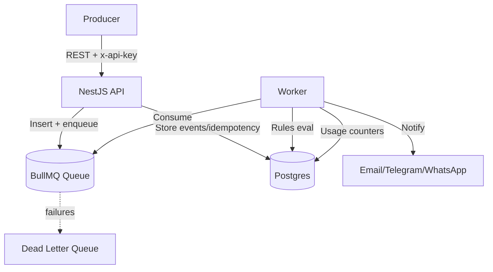

# SignalOps

Event-driven, multi-tenant SaaS backend (NestJS + Postgres + Redis/BullMQ) with configurable rules, notifications, and usage tracking. Architecture details live in `docs/architecture.md`.

## What this is (and how it works)

- Ingest tenant-scoped business events quickly via REST (`/api/events`) with API-key auth.
- Store events with idempotency, enqueue them (BullMQ/Redis), then workers evaluate rules, send notifications, and track usage/billing counters.
- Soft/hard limits per tenant protect the system; DLQ captures persistent failures.

## Architecture at a glance



## Getting Started

1. Install dependencies: `npm install`
2. Copy `env.sample` → `.env` and adjust secrets.
3. Run services locally: `docker-compose up --build`
4. Start API only: `npm run start:dev` (requires Postgres/Redis reachable)
5. Start worker: `npm run worker`

## Key Endpoints

- `POST /api/events` — ingest events. Headers: `x-api-key`, optional `idempotency-key`. Body: `{ type, payload, source?, occurredAt? }`.

## Moduleş̌̌

- Auth (JWT + API keys), Events (ingestion + idempotency + enqueue), Rules (versioned JSON), Notifications (provider abstraction), Billing (usage counters), Queue (BullMQ).

## Testing / Quality

- Lint: `npm run lint`
- Build: `npm run build`

## Manual Smoke Test

1. Seed a tenant + API key (migrations pending):
   - Generate key + hash: `node -e "const b=require('bcryptjs');const key='test_api_key_123';console.log({key,prefix:key.slice(0,16),hash:b.hashSync(key,12)});"`
   - Insert into DB (example):
     ```
     INSERT INTO tenants(id,slug,name,status,plan,"monthlySoftLimit","monthlyHardLimit")
     VALUES (gen_random_uuid(),'acme','Acme Inc','active','free',100000,120000);
     INSERT INTO api_keys(id,"keyHash","keyPrefix",label,scopes,"tenantId")
     VALUES (gen_random_uuid(),'<HASH>','<PREFIX>','seed key','{}',(SELECT id FROM tenants WHERE slug='acme'));
     ```
2. Run API and worker: `npm run start:dev` (or `npm start` after build) and `npm run worker` with `DATABASE_URL` set (Supabase: include `?sslmode=require`).
3. Ingest event:
   ```
   curl -X POST http://localhost:3000/api/events \
     -H "Content-Type: application/json" \
     -H "x-api-key: test_api_key_123" \
     -d '{"type":"user.signup","payload":{"email":"user@example.com"}}'
   ```
4. Swagger UI: `http://localhost:3000/api/docs` for interactive testing (JWT bearer + x-api-key supported).
5. Check worker logs for rule/notification processing; failed jobs go to `events-dlq`.

## Deployment

- Dockerfile provided (multi-stage). Compose includes Postgres/Redis + worker.
- GitHub Actions workflow `.github/workflows/ci.yml` runs lint/build.

## Notes

- Notification providers are stubbed; wire to real SMTP/Telegram/WhatsApp SDKs.
- Add database migrations before production (TypeORM CLI or custom).
