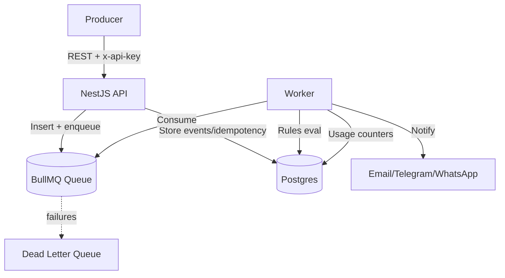

# SignalOps

Event-driven, multi-tenant backend (NestJS + Postgres + Redis/BullMQ) for ingesting business events, evaluating tenant-specific rules, sending notifications, and tracking usage/billing.

## Project Summary

- **Goal**: Fast, reliable event ingestion with per-tenant isolation, async processing, and configurable actions.
- **Core flow**: API receives events → stores/idempotent → enqueues → worker evaluates rules → notifications + usage counters.
- **Ops**: Soft/hard limits, retries with backoff, DLQ for persistent failures.

## Architecture Diagram



## Tech Decisions (why this stack)

- **NestJS + TypeScript**: Structured modules, DI, and guards for JWT/API-key auth.
- **Postgres**: Strong consistency and relational modeling with JSONB payload flexibility.
- **Redis + BullMQ**: Lightweight, reliable queueing with retries/backoff and DLQ without microservice overhead.
- **Modular monolith**: Shared codebase/DB, async isolation via queue; avoids premature microservices complexity.

## API Endpoints (core)

| Method | Path        | Auth               | Purpose                   |
| ------ | ----------- | ------------------ | ------------------------- |
| POST   | /api/events | x-api-key (header) | Ingest event (idempotent) |
| GET    | /api/docs   | optional           | Swagger UI (JWT/API key)  |

Payload for `/api/events`:

```json
{
  "type": "user.signup",
  "payload": { "email": "user@example.com" },
  "source": "app",
  "occurredAt": "2025-12-15T00:00:00Z"
}
```

## Getting Started

1. Install deps: `npm install`
2. Env: copy `env.sample` to `.env`; set `DATABASE_URL` (with `sslmode=require` for Supabase) and `REDIS_HOST` (use `127.0.0.1` locally).
3. Build: `npm run build`
4. Run API: `npm run start:dev`
5. Run worker: `npm run worker`
6. Swagger: `http://localhost:3000/api/docs`

### Seed (temporary, migrations pending)

```sql
INSERT INTO tenants(id,slug,name,status,plan,"monthlySoftLimit","monthlyHardLimit")
VALUES (gen_random_uuid(),'acme','Acme Inc','active','free',100000,120000)
ON CONFLICT (slug) DO NOTHING;

INSERT INTO api_keys(id,"keyHash","keyPrefix",label,scopes,"tenantId")
VALUES (
  gen_random_uuid(),
  '$2a$12$6/BEeH39Jw5EpbWPIFiNxOq2/LONKgWDev/dUicvliI47gBP4q/we',
  'test_api_key_807',
  'seed key',
  '{}',
  (SELECT id FROM tenants WHERE slug='acme')
);
```

Test ingestion:

```bash
curl -X POST http://localhost:3000/api/events \
  -H "Content-Type: application/json" \
  -H "x-api-key: test_api_key_8077c438f557" \
  -d '{"type":"user.signup","payload":{"email":"user@example.com"}}'
```

## Quality Signals

- Lint: `npm run lint`
- Build: `npm run build`
- CI: GitHub Actions (`.github/workflows/ci.yml`) runs lint + build.
- Retry/DLQ: BullMQ with exponential backoff and dead-letter queue.

## Proof, Gaps, and How We’ll Show It

- **Load under stress (planned)**: Add k6/Artillery script to drive 10k+ events/min; report queue depth, latency, and worker throughput; monitor Redis memory during spike.
- **Failure exercises (planned)**: Chaos steps—kill worker mid-job; force provider failure to hit retries/DLQ; verify poisoned message isolation.
- **Billing/idempotency**: Ingestion is idempotent on `(tenantId, idempotencyKey)`; usage increments happen post-processing. Next: add exactly-once billing test and crash/ retry accounting scenario.
- **Tenant isolation**: Per-request tenant scoped via API key/JWT; all writes include `tenantId`. Next: add row-level policies or a global query filter to hard-enforce scoping and add a “no cross-tenant read” test.
- **Rule engine safety**: Current JSON rules, equals matcher only. Next: define rule grammar, cap payload size/conditions, and add version-migration story.
- **Observability (planned)**: Structured logging with correlation IDs, queue depth and failure-rate metrics, alerts on DLQ growth and soft/hard-limit breaches.
- **Known limits / not suitable yet**: No migrations/seed automation; notification providers are stubs; no SLA-grade observability; billing not proven under partial failures.

## Roadmap

- Add proper database migrations and seed scripts (remove manual SQL).
- Implement real notification providers (SMTP/SES, Telegram, WhatsApp) with delivery status storage.
- Add rate limiting middleware and richer rule operators/templates.
- Optional: Bull Board UI for queue observability.
- Expand tests (unit/e2e) and add metrics/alerts.

## Decisions & Tradeoffs

- Modular monolith over microservices to avoid premature ops overhead; async queues provide workload isolation without service sprawl.
- BullMQ/Redis over Kafka for simpler ops at this scale; gains retries/backoff/DLQ with minimal infra.
- Postgres over NoSQL to keep strong consistency for tenants/usage/billing while using JSONB for flexible payloads.
- Not built (yet): provider delivery persistence, migrations automation, rich rule grammar, rate limiting, metrics/alerts—kept scope lean to ship core flow.
- Known limits: single-region, no sharding/partitioning strategy implemented; notification providers are stubs.

## Who this is for

SignalOps is for SaaS teams that need reliable event ingestion, internal alerts, and usage-based accounting without over-engineering—fast to stand up, clear tenant isolation, and room to grow into fuller observability and delivery guarantees.
